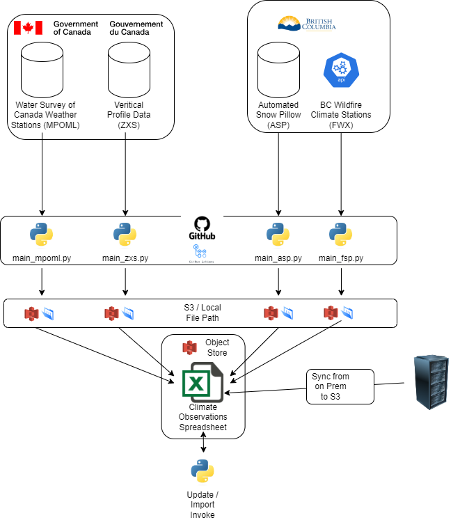

# Architecture

## Background

Work in this repo is related to building a scaleable data pipeline that injests the
various data sources for climate observations, in some cases performs transformations
and ultimately imports the data into the various hydrological models input data
spreadsheets.

[link to drawio diagram](./climate_obs_architecture.drawio)

## Architecture Journey

### Phase 1 - Rebuild pipeline using github actions - NOW

Rebuild the existing pipeline to allow for off prem execution taking advantage of
scaleability that comes with this flow, as well as easier sharing of data by pivoting it
to object storage.

This phase will execute jobs based on a cron schedule

* **documentation** - as rework processes document the business rules in code and in
    readme's
* **scheduling** - windows scheduler -> github actions (cron based)
* **persistence** - shared file and print -> object storage

### Phase 2 - Enable event based pipeline - [FUTURE](https://github.com/bcgov/nr-rfc-climate-obs/issues/12)

Having rebuilt the pipeline, the next phase will be to enable execution based on
availability of the data using the federal governments message queue.  See
[this repo](https://github.com/bcgov/nr-rfc-grib-copy)
for an example of how to deploy this.

## Components

### Federal Government - Datamart

All data that originates from the federal government comes from their
[data mart url](https://hpfx.collab.science.gc.ca/)

#### Water Survey of Canada Weather Stations

Climate station data collected from the canadian hydrological survey, downloaded from
the federal governments datamart. Example url: https://hpfx.collab.science.gc.ca/20231016/observations/xml/BC/today/ [Metadata record](https://eccc-msc.github.io/open-data/msc-data/obs_station/readme_obs_insitu_xmldatamart_en/)

#### Veritical profile

Vertical profile data.  [Metadata record](https://eccc-msc.github.io/open-data/msc-data/vertical-profiles/readme_vertical-profiles-obs-datamart_en/)

### BC Data

#### Automated Snow Pillows

Weather station data collected at the automated snow pillow locations.

[metadata record](https://catalog.data.gov.bc.ca/dataset/automated-snow-weather-station-locations)

#### WildFire Weather Stations

Weather stations data that is collected managed and maintained by BC Wildfire Services.

[metadata record](https://catalog.data.gov.bc.ca/dataset/bc-wildfire-active-weather-stations)

## Scripts

Scripts located in the folder `scripts/python` that are used to pull and transform the
various data sets above.  All the scripts will pull the remote data, create a local
version of the data, and ultimately upload the data to object storage.

The repo contains a sample .env_sample file that lists the various environment
variables that the scripts in this repo will use.

Scripts connect to object storage using the env parameters:
* **OBJ_STORE_BUCKET** - the bucket
* **OBJ_STORE_SECRET** - the secret
* **OBJ_STORE_USER** - access key
* **OBJ_STORE_HOST** - host, defaults to nrs.objectstore.gov.bc.ca

All the scripts also use this environment variable to determine what data to retrieve.  Default is set to 0 which will pull the current days data.

* **DEFAULT_DAYS_FROM_PRESENT**

The github actions that orchestrate the running of the various scripts below get
named with `run_` as their prefix.  Currently the ZXS script is being run on openshift, however this script will get moved to a github action soon.

Actions:
* **run_asp.yaml**
* **run_fwx.yaml**
* **run_mpoml.yaml**

### main_fwx.py

Pulls the data from the bc wildfire api to object storage and to a local directory.  The
local directory where the data is cached is defined by the environment variable:

* **F_WX_DATA_DIR**

### main_asp.py

Pulls data from the http enabled ftp site:
[https://www.env.gov.bc.ca/wsd/data_searches/snow/asws/data/]()
Copies the following files:

* TA.csv - Temperatures
* PC.csv - Precipitation
* SD.csv -
* SW.csr -

Script uses these env variables:

* **ASP_ENV_DATA_DIR** Where the 4 files above get stored (TA.csv, PC.csv, SD.csv, SW.csv)
* **ASP_PREPD_DATA_DIR** Transformed version of this data
* **ASP_OSTORE_RAW_DATA_DIR** Direcotory in object storage where the raw data will be stored.
* **ASP_OSTORE_PREPD_DATA_DIR** Directory where the modified / transformed version of this data in object storage

### main_mpoml.py

Pulls the data from federal government data mart, local directory where data is
stored:

* **MPOML_DATA_DIR**

### main_zxs.py

Pulls the vertical profile data from the federal government data mart.  The local
directory where the data gets stored is controlled by the env variable:

* **ZXS_DATA_DIR**

## Object Storage

As previously mentioned in the scripts section, object storage credentials are retrieved
from the environment.

For some of the data the current autoritative source continues to reside on on-prem
services.  For these processes the data is getting replicated to object storage using
jenkins jobs.

Code for these processes resides in `scripts/bat`

